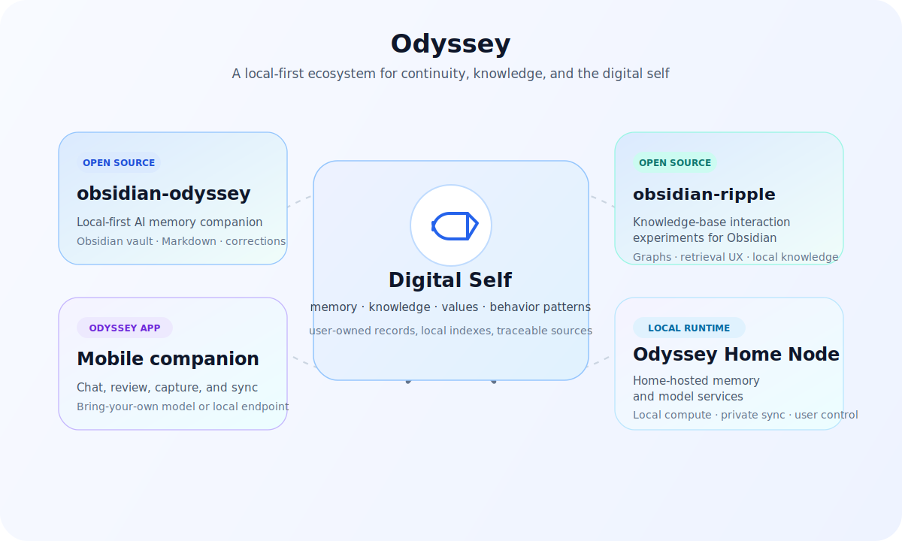

# Odyssey

> Meet yourself along the way.

AI can answer almost anything, yet many conversations still begin as if you had
never met before.

You explain your background again. You reconstruct a decision from fragments.
Your notes, memories, preferences, and hard-won patterns of thinking are split
across apps that rarely understand one another. You trust a memory feature that
you cannot inspect, correct, or take with you. When the account disappears, the
thread disappears with it.

Odyssey is a broader effort to build a different kind of relationship with AI:
one grounded in continuity, user-owned records, and a digital self that remains
inspectable instead of becoming a hidden profile. We open-source selected
components where public review, local ownership, and community use matter most.

## Why Continuity Matters

In Homer's epic, Odysseus spent ten years finding his way home. When he finally
arrived, appearance was not enough to establish who he was. Penelope tested him
with a shared memory: the secret of their bed.

Identity, in that moment, was not proven by a profile. It was proven by
continuity.

That distinction matters for personal AI. Storage is useful, but storage alone
is not continuity. A folder can preserve facts. A profile can flatten you into
traits. A digital self should be richer and more accountable: memory, knowledge,
values, and behavior patterns that remain traceable to their sources and can
change responsibly when understanding changes.

## What We Are Building

The public overview above shows the shape of the Odyssey ecosystem: a
user-owned digital self at the center, with different surfaces for capturing,
organizing, recalling, and running personal AI locally.

Our public open-source components currently include:

- **[Odyssey for Obsidian](https://github.com/meetodyssey/obsidian-odyssey)**:
  a local-first AI memory companion that stores conversations, source-backed
  memories, and corrections as readable Markdown in your own vault.
- **[Obsidian Ripple](https://github.com/meetodyssey/obsidian-ripple)**:
  public experiments around knowledge-base interaction, graph-based recall, and
  local note-centered AI workflows.

Together, these projects serve a simple but demanding use case:

> Talk with AI over time without surrendering ownership of the history that
> makes those conversations meaningful.

These open-source projects are part of a broader Odyssey ecosystem that also
includes the Odyssey mobile app and Odyssey Home Node:

- **Odyssey mobile app**: a companion interface for chat, review, capture, and
  sync across everyday contexts.
- **Odyssey Home Node**: a local runtime for home-hosted memory and model
  services, keeping private compute close to the user.

The broader work explores how personal AI systems can preserve continuity while
remaining inspectable, portable, correctable, and private by design.

## Our Principles

**Local first.** Your memory, knowledge, and personal records should live with
you, not behind a hosted account. If Odyssey disappeared tomorrow, your files
should still be readable.

**Inspectable.** You should be able to see what the system remembered, what it
learned from your knowledge base, and where that understanding came from.

**Correctable.** AI gets things wrong. People also change their minds, remember
differently, and revise earlier beliefs. Odyssey keeps corrections alongside
the original record instead of silently rewriting history.

**Sovereign.** A system that preserves a digital self should not hold that
record hostage. Portability is part of the product, not an export checkbox added
later.

**Private by design.** Privacy is a boundary. Local models should remain a
first-class option, and cloud inference should always be an explicit user
choice.

## Start Here

- Explore [Odyssey for Obsidian](https://github.com/meetodyssey/obsidian-odyssey)
- Explore [Obsidian Ripple](https://github.com/meetodyssey/obsidian-ripple)
- Read the [Odyssey for Obsidian installation guide](https://github.com/meetodyssey/obsidian-odyssey/blob/main/docs/installation.md)
- Open an issue to report a bug, request a feature, or discuss memory quality

## Status

Odyssey is in early development. The Obsidian plugin is being prepared for its
first public release. Expect active iteration around model setup, retrieval
quality, correction workflows, and resilient conversations.

## A Note on AI

Odyssey uses AI-generated responses, which may be wrong, incomplete, or based
on misunderstood context. It is not a substitute for medical, legal, financial,
mental-health, safety, or other professional advice.
